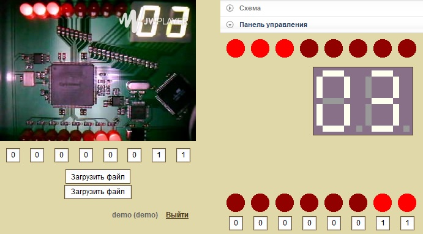

# Миграция процессора на EP1C3T144C8N

Миграция процессора schoolMIPS на плату EP1C3T144C8N.

## Входы процессора
* Переключатели C1, B1, A1, D2, C2 задают номер выводимого регистра.
* Переключатель A2 при подаче 0 сбрасывает систему в начальное состояние (reset).
* Переключатель B2 при подаче 0 отключает тактовый сигнал, останавливая работу процессора в текущем состоянии.

## Выходы процессора
* На семисегментные индикаторы IND_1[A..G] и IND_2[A..G] выводятся две младшие цифры содержимого регистра в шестнадцатеричном представлении.
* На светодиоды LED[7:1] выводятся младшие шесть бит содержимого выводимого регистра.
* На светодиод LED[0] выводится тактовый сигнал.

## Порядок запуска

Для запуска процессора на плате требуется создать rbf файл и загрузить его ны [виртуальный стенд](http://www.labfor.ru/online/fpga/run) или на соответствующую плату.

### Результат запуска на плате

При выборе ругистра 0 выводится счетчик команд. Результат работы программы находится в регистре 2.

