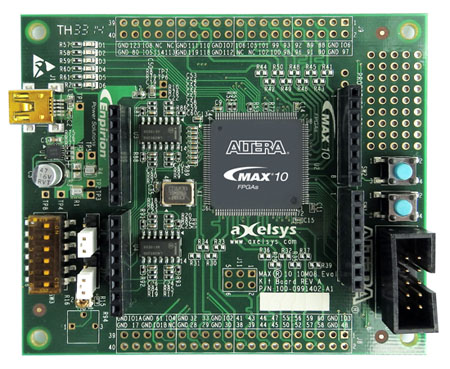
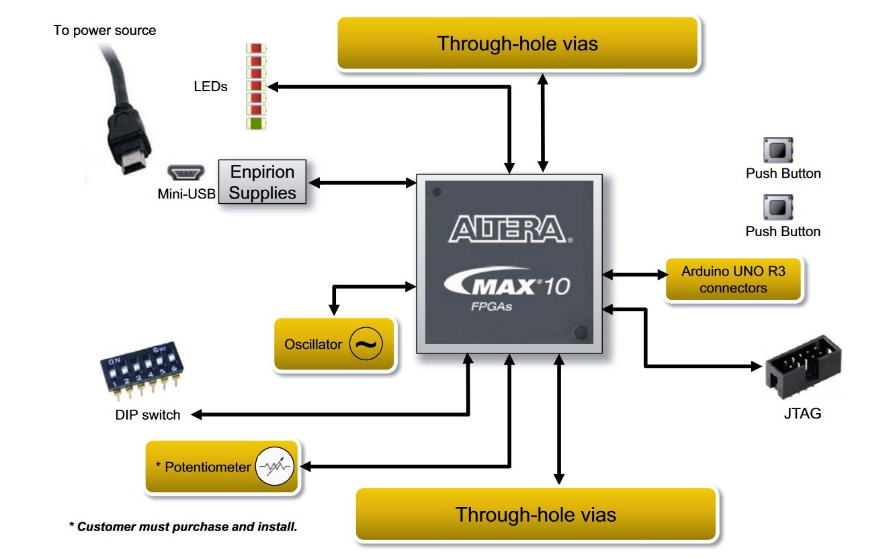
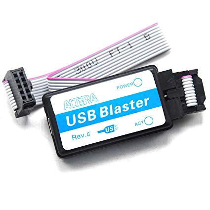

# MAX 10 FPGA Evaluation Kit
## Описание платы
Max 10 FPGA Evaluation Kit отладочная плата компании Intel начального уровня. В плате используется микросхема 10M08SAE144C8G серии MAX 10.

Плата включает следующие компоненты:

- Микросхема серии MAX10 FPGA
- Intel Enpirion® EP5388QI DC-DC понижающий преобразователь
- JTAG разъем для программирования платы
- Тактовый генератор на 50МГц
- АЦП встроенный в микросхему MAX 10 
- Переключатели, кнопки, перемычки и сигнальные светодиоды
- Пробная точка для измерения питания микросхемы
- Разъемы формата Arduino UNO для подключения переферии
- Отверстия GPIO для подключения переферии
- Mini-USB разъем для питания платы 

Для программирования платы используется внешний программатор, подключаемый через JTAG разъем.

## Ссылки
1. [Страница с описание платы MAX 10 FPGA Evaluation Kit на сайте Intel](https://www.intel.com/content/www/us/en/programmable/products/boards_and_kits/dev-kits/altera/kit-max-10-evaluation.html#Contents)
2. [Руководство пользователя платы MAX 10 FPGA Evaluation Kit](https://www.intel.com/content/dam/www/programmable/us/en/pdfs/literature/ug/ug_max10_eval_10m80.pdf)

