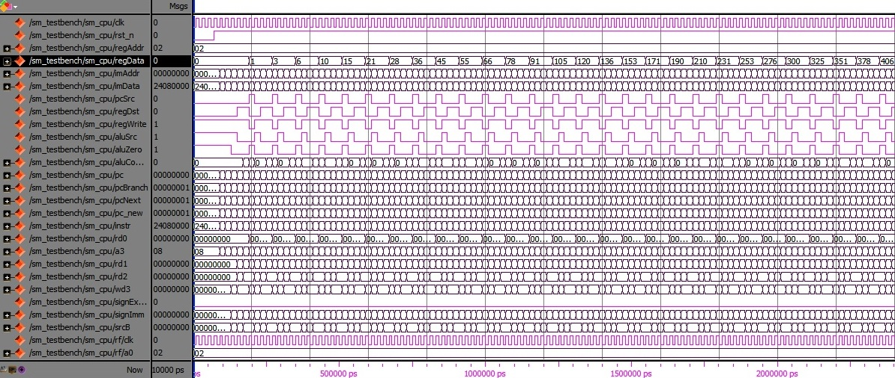

# Подсчет натурального ряда

Программа считает сумму натуральных чисел (натуральный ряд) от 1 до текущего значения счетчика, счетчик увеличивается последовательно на 1.

## Натуральный ряд
iый элемент ряда равен сумме всех натуральных чисел от 0 до i включительно.
Ряд представляет собой 1, 3, 6, 10, 15, 21, 28..

## Порядок запуска

Для запуска программы и копирования файла памяти инструкций в каталог board/program требуется запустить скрипт start_modelsim.bat или последовательно скрипты 00_clean_all.bat, 01_compile_and_link.bat, 02_disassemble.bat, 03_generate_verilog_readmemh_file.bat, 04_simulate_with_modelsim.bat и 05_copy_program_to_board.bat. 

### Результат моделирования

На выводе regData выводится результат работы функции.

